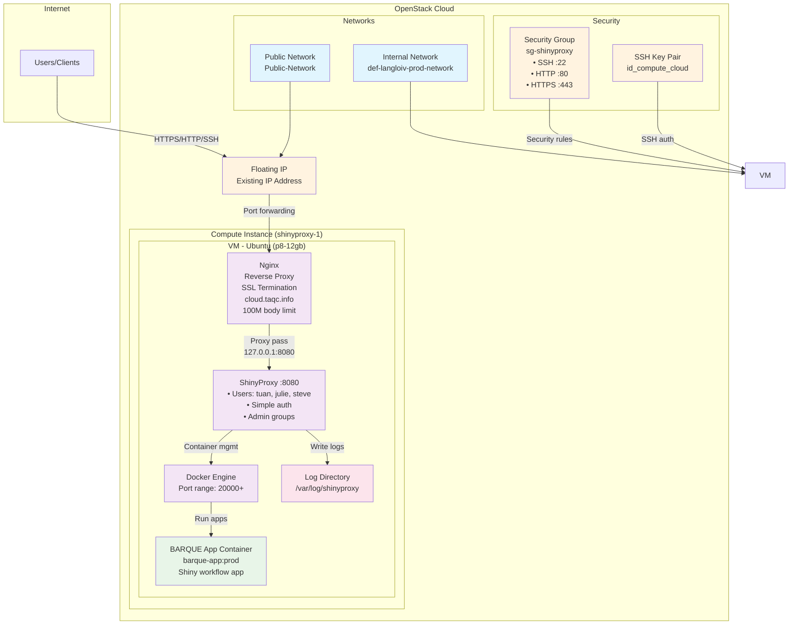

# ShinyProxy OpenStack Terraform Deployment

This Terraform configuration deploys a ShinyProxy application server on OpenStack cloud infrastructure with automated SSL certificate provisioning and Docker-based application hosting.

## Architecture

## Infrastructure Components

### Network Configuration
- **External Network**: `Public-Network` - Provides internet connectivity
- **Internal Network**: `def-langloiv-prod-network` - Private network for VM placement
- **Floating IP**: Pre-existing floating IP associated with the instance for external access

### Security
- **Security Group**: `sg-shinyproxy` with rules for:
  - SSH access (port 22) - restricted to specific CIDR
  - HTTP access (port 80) - public access
  - HTTPS access (port 443) - public access

### Compute Resources
- **Instance**: `shinyproxy-1`
  - Flavor: `p8-12gb` (8 vCPUs, 12GB RAM)
  - Image: Ubuntu (ID: 241de10b-becc-4d4d-a622-61695e5cb94f)
  - Key Pair: `id_compute_cloud` for SSH access

### Application Stack
- **Nginx**: Reverse proxy with SSL termination via Let's Encrypt
- **ShinyProxy**: Application server (v3.2.0) running on port 8080
- **Docker**: Container runtime for hosting Shiny applications
- **BARQUE Application**: Custom Shiny app (`barque-app:prod`) for workflow execution

## Deployment Features

### Automated Setup (Cloud-Init)
- Package installation (Docker, Nginx, Certbot, Java)
- User creation with Docker and sudo privileges
- SSL certificate provisioning for `cloud.taqc.info`
- Firewall configuration (UFW)
- ShinyProxy installation and configuration
- Docker image building from GitHub repository

### User Management
- Three configured users: `tuan`, `julie`, `steve` (admin)
- Simple authentication with password protection
- Group-based access control (`scientists`, `admin`)

### Application Configuration
- Custom login page with taqc Community branding
- Container log management in `/var/log/shinyproxy/container-logs`
- Port range allocation starting from 20000
- 100MB client body size limit for file uploads

## Usage

1. Configure variables in `terraform.tfvars`
2. Initialize Terraform: `terraform init`
3. Plan deployment: `terraform plan`
4. Apply configuration: `terraform apply`
5. Access ShinyProxy at: `https://cloud.taqc.info`

## Outputs

- **instance_name**: Name of the created instance
- **instance_id**: OpenStack instance ID
- **floating_ip**: Public IP address for access
- **ssh_command**: Ready-to-use SSH connection command
- **shinyproxy_url**: Direct URL to the ShinyProxy application
